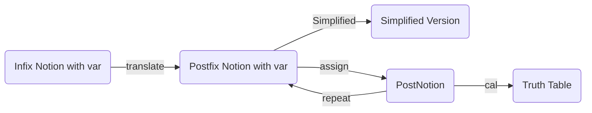
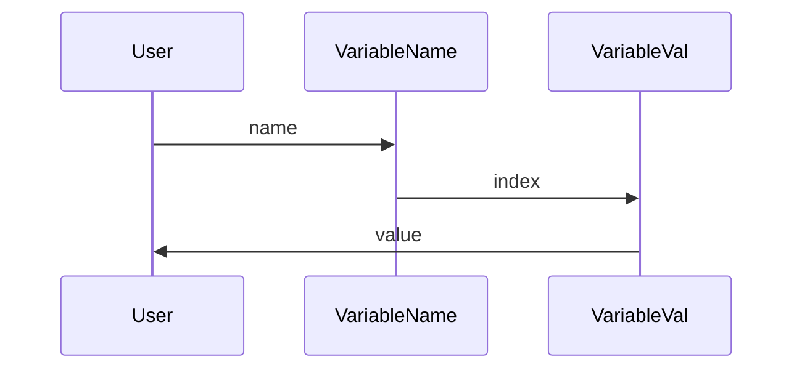
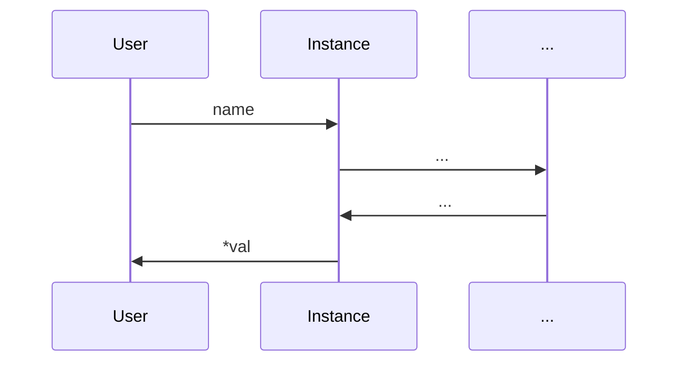

## 用于计算逻辑运算表达式的程序流程

### 算法流程：



### Infix Notion Concepts


#### variables

取值为`{true,false}`，由一个或者多个连续字母表示

合法变量：`p` , `q` , `var` , `ksks` , `ty`

不合法变量：`val1` (必须由纯字母构成), `v~ar`(必须由连续字母构成)

在本程序中， $Variables$ 由两大部分组成：

1. 第一大部分为 $Variables$的实例

   ```C++
   private:
   	//变量名，用于区分变量的唯一标识
   	string name;	
   	//通过val指针间接访问变量值
   	bool* val;
   ```

   实例中记录了每一个 $Variables$ 的变量名 $name$，并作为区分变量的唯一标识。同时，每一个 $Variables$实例中都含有一个指针 $val$，指向为变量名为 $name$的变量分配的值。实例通过这个指针间接的访问该变量的值.

   

2. 第二大部分为$Variables$的静态数据成员部分

   静态成员部分记录了所有变量的变量名，以及不重复变量的总个数 $Varcnt$。

   $VariableName$将变量名映射到一个唯一的编号 $VariableName:name->index$ 。 

   同时，通过编号可以快速取出该变量的值 $VariableVal:index->value$

   $ConstFlag$用于记录编号为 $index$的变量是否是一个常量

   $VarSeq$ 建立了 $name$和 $index$的反向映射

   ```mermaid
   graph LR
   name--VariableName-->index
   index--VarSeq-->name
   index--VariableVal-->value
   index--ConstFlag-->constancy
   
   
   
   ```

   

   ```C++
   //将变量名映射到变量编号
   	static map<string, int> VariableName;
   
   	//输入变量编号，输出该变量的值
   	static bool VariableVal[maxVariables];
   
   	//判断这个变量的值是否是一个常值
   	static bool ConstFlag[maxVariables];
   
   	//统计变量个数
   	static int Varcnt;
   
   	//输入变量编号，输出变量名
   	static string VarSeq[maxVariables];
   ```

   

当您仅知道一个变量的变量名 $name$，并且想获取它对应的值时，您需要经历一下过程：

1. 先将 $name$在 $VariableName$ 中取出对应的 $ID$
2. 通过 $ID$在 $VariableVal$ 中取出变量对应的值 $value$




或者，您也可以通过创建一个 $Variables$实例，通过内部的 $val$指针快速访问对应的值。当然， $Instance$内部同样会进行上述类似查询ID、查询value操作，但是您并不需要知道发生了什么， $val$指针将上述复杂的求值步骤封装起来。



总而言之，Variables的值与这个Variables的实例是弱耦合的。实例通过一根指向 $VariableVal$的指针来访问它的值。类似地，通过修改 $VariableVal$就可以快速对变量的所有实例进行赋值


#### operator

一共有五种逻辑运算符： $\neg$, $\wedge$, $\lor$, $\rightarrow$, $\Leftrightarrow$ ， $\bigoplus$ (逻辑非，逻辑合取，逻辑析取，单蕴含，双蕴含，逻辑异或)

在简化版本中，两个逻辑运算符 $\neg$, $\lor$ 两个运算符构建了一套完整的逻辑运算体系。其他所有的逻辑运算符都能被这两个运算符表示

1. $\neg$

   单目运算符，优先级为**6**

   真值表：

   | $p$     | $\neg p$   |
   | --------- | --------- |
   | $True$  | $False$ |
   | $False$ | $True$  |

   

2. $\wedge$

   CONJ，合取运算符，双目运算符，优先级为**5**

   在简化版本中，合取运算符被定义为 $p\land q\equiv\neg(\neg p\lor\neg q)$

   真值表：

   | $p$     | $q$     | $p\wedge q$ |
   | --------- | --------- | ------------- |
   | $True$  | $True$  | $True$      |
   | $True$  | $False$ | $False$     |
   | $False$ | $True$  | $False$     |
   | $False$ | $False$ | $False$     |

   

3. $\lor$

   DISJ，析取运算符，双目运算符，优先级为**4**

   真值表：

   | $p$     | $q$     | $p\lor q$ |
   | --------- | --------- | ----------- |
   | $True$  | $True$  | $True$    |
   | $True$  | $False$ | $True$    |
   | $False$ | $True$  | $True$    |
   | $False$ | $False$ | $False$   |

    

4. $\bigoplus$

   Xor, 异或运算符，双目运算符，优先级为**3**

   在简化版本中，异或被定义为： $p\bigoplus q\equiv \neg(\neg x \lor y)\lor \neg (\neg y\lor x)$

   真值表：

   | $p$     | $q$     | $p\bigoplus q$ |
   | ------- | ------- | -------------- |
   | $True$  | $True$  | $False$        |
   | $True$  | $False$ | $True$         |
   | $False$ | $True$  | $True$         |
   | $False$ | $False$ | $False$        |

   

5. $\rightarrow$

   单蕴含，双目运算符，优先级为**2**

   在简化版本中，单蕴含被定义为： $p\rightarrow q \equiv \neg p \lor q$

   真值表：

   | $p$     | $q$     | $p \rightarrow q$ |
   | --------- | --------- | ------------------- |
   | $True$  | $True$  | $True$            |
   | $True$  | $False$ | $False$           |
   | $False$ | $True$  | $True$            |
   | $False$ | $False$ | $True$            |

   

6. $\Leftrightarrow$

   双蕴含，双目运算符，优先级为**1**

   在简化版本中，双蕴含被定义为： $p\Leftrightarrow q  \equiv \neg(\neg p\lor \neg q)\lor \neg(p \lor q)  $

   真值表：

   | $p$     | $q$     | $p\Leftrightarrow q$ |
   | --------- | --------- | ------------- |
   | $True$  | $True$  | $True$      |
   | $True$  | $False$ | $False$     |
   | $False$ | $True$  | $False$     |
   | $False$ | $False$ | $True$      |


### Translate过程


#### 前期准备：

准备工作：输出数组 $Output$，符号栈 $SignStack$，变量映射 $VarMap$，变量数组 $VarValue$,  $VarCnt$记录 $VarValue$大小

1. $Output$ 记录最后的逆波兰表达式，在逆波兰表达式中，仅有符号 $Sign$和变量 $Variable$
2. $SignStack$ 用于储存 $operator$
3. $VarMap$，将变量的名字映射到 $VarValue$的一个位置上。同名的变量映射的位置相同，不同名变量映射位置不同。在后续的 $assign$步骤中，variable的值从 $VarValue[VarMap[VariableName]]$中取出
4. $VarValue$，用来存储<u>不同变量</u>的值，顺序储存

 $Variable$类型要求具有：$VarName$名字

 $Operator$类型要求具有：$Priority$优先级，具体类型（左括号/右括号）

#### 

#### 逆波兰表达式详细过程：

从左向右依次扫描逐个元素

1. 如果是变量名：
   1. 检查是否有同名变量( $VarMap[VarName]是否为0$)
      1. 如果没有则在 $VarValue$开辟一块新位置， $VarCnt++$，并将其与 $VarMap$绑定( $VarMap[VarName]=VarCnt$)
      2. 如果存在，则不做任何操作
   2. 直接将该元素输出到 $Output$中
   
2. 如果是符号：
   1. 如果是左括号，直接入栈
   
   2. 如果是右括号， $SignStack$将栈顶元素一直输出到 $Output$中，直到遇到左括号并将其抵消
   
   3. 若是其他操作符，将栈顶所有**优先级不小于该操作符**的元素输出（保证栈内元素优先级严格递增）
   
      如果是一元运算符 $\neg$，则**直接入栈**，当表达式为 $\neg \neg \neg p$ 时，正确的波兰表达式应当是 $p \neg \neg \neg$ ，而不是 $\neg \neg p \neg$.


### Assign过程

当进入Assign过程时，所有原始变量均计入 $Variables$中，对存在 $Variables$中非 $Const$变量进行逐一赋值即可

```C++
//Assign.h Line 20-25
for (int i = 0; i <= 1; ++i)
{
	if (Variables::ConstFlag[step] != 1) Variables::VariableVal[step] = i;
	else i++;
	dfs(step + 1);
}
```


### Calculate过程

准备过程： $Output$  $VarStack$ 

#### 计算详细过程：

1. 如果是变量：
   1. 直接进入 $VarStack$
2. 如果是符号：
   1. 判断是几目操作符
      1. 一目操作符（ $\neg$）
         1. 从 $VarStack$中取出一个变量 $var$，进行运算后创建一个新的变量( $\neg (var)$ )。该变量的值等于计算后的值，名字为 $\neg (var)$,即在原变量扩上一个括号并加上一个取反，重新放入栈中
      2. 双目操作符
         1. 从 $VarStack$中取出两个变量 $var1，var2$，进行运算后创建一个新的变量 $(var1)?(var2)$ 。该变量的值等于计算后的值，名字为 $(var1)?(var2)$,即在原变量扩上一个括号并加上符号，重新放入栈中
3. 计算结束后，栈内最后一个元素即为计算结果


### Repeat过程

```C++
//递归赋值
void dfs(int step)
{
	//复制完成后，开始计算，输出结果
	if (step == maxstep + 1) { Calculator ca(postfix); ca.work(); Outputer out; out.outputone(); return; }
	for (int i = 0; i <= 1; ++i)
	{
		if (Variables::ConstFlag[step] != 1) Variables::VariableVal[step] = i;
		else i++;
		dfs(step + 1);
	}
}
```

进行一个递归的大动作。Assign中 $maxstep$代表原始变量的个数， $step$代表现在将要进行第step个变量的赋值。

当 $step==maxstep+1$ 时，代表全部原始变量都已经被赋值完毕，可以开始求解计算。当计算完毕，返回，开始进行下一轮赋值


### Simplified过程

#### 问题确立

简化过程中最难的一步就是**确定需要简化的运算符左右两边的操作数是什么**，例如：在  $\neg p \lor \neg q$ 这个算式中，析取的是 $p、q$ ，还是 $\neg p、q$ ，还是 $p、\neg q$ ，还是 $\neg p、\neg q$ ，仅凭借中缀表达式很难入手。

类似地，在一些带有很多括号、极为复杂的表达式中，中缀表达式难以定序、逻辑复杂的缺点展现得淋漓尽致。因此，我从没有括号，容易确定操作数的后缀表达式入手。


#### 后缀表达式转中缀表达式

我们需要将已知的后缀表达式重新转换成中缀表达式。一般来说，将后缀表达式转换成中缀表达式的过程为以下几步：

需要初始化一个 $Stack$，用于存放当前暂时还不能确定运算次序的 $Variable$。用栈实现后缀表达式转中缀表达式的逻辑过程：

① 从左往右扫描下一个元素，直到处理完所有元素；

② 若扫描到 $Variable$则压入 $Stack$，并回到①，否则执行③；

③ 若扫描到运算符，则弹出两个栈顶元素（注意：先出栈的是“右操作数 $rhs$ ”），构成( $lhs·operator·rhs$ )，然后将其压回栈顶，回到①。

若被扫描的后缀表达式是合法的，则最后栈中**只会留下一个元素**，就是最终结果。


#### 改进后算法

 注意到，在第③ 步中，我们将栈顶两个 $Variables (rhs, lhs)$ 弹出，然后与操作符合并成一个新 $Variable(lhs·operator·rhs)$，最后压回到栈中。如果我们将栈顶两个 $Variables$弹出后压入一个与 $Variable(lhs·operator·rhs)$ 等价的 $Variable$ ，即实现了计算式的简化


##### eg. 简化：

$$
p\land q
$$

1. 计算出该式子的逆波兰表达式（后缀表达式）： $p·q·\land$

2. 执行改进后算法，当读入到 $\land$时，变量栈 $Stack$中有两个元素：

   | Stack |
   | :---: |
   |  $q$  |
   |  $p$  |

   弹出这两个元素，拼凑出一个新的变量 $p \land q$. 在改进算法中，我们不会将这个新变量压入栈中，而是通过预设找到与 $p\land q$ 等价的运算 $\neg(\neg p\lor\neg q)$，将这个运算作为一个变量压入栈中

   |          Stack           |
   | :----------------------: |
   | $\neg(\neg p\lor\neg q)$ |

3. 运算结束，弹出栈顶的元素，即为简化后的表达式


